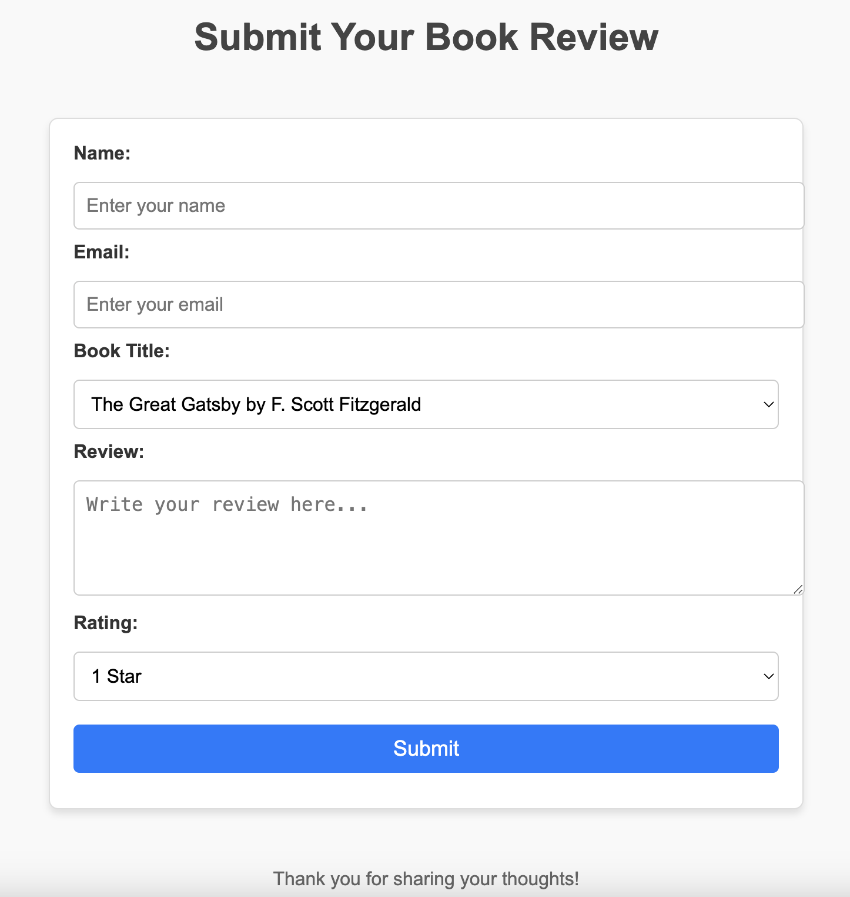

[](https://github.com/ailina-aniwan/Ailina_Aniwan_Mini_Project_12/actions/workflows/CI.yml)

# IDS706 - Mini Project 12 - Ailina Aniwan

## Dockerized Application - Book Review Submission App
This is a simple Flask-based web application that allows users to submit reviews for their favorite books. The app is fully containerized using Docker, enabling easy deployment and portability. Users can select a book, write a review, and provide a star rating through a clean and responsive web interface.

### Features
- Submit book reviews with a name, email, book title, review text, and rating.
- Clean and modern design with a user-friendly form interface.
- Fully containerized for portability using Docker.
- CI/CD pipeline for automated builds and deployments using GitHub Actions.

### App Overview


### Setup Instructions
- Prerequisites: Docker installed on your local machine; Docker Hub account (if you want to push the image to your own repository).
- Clone the Repository
    ```bash
    git clone https://github.com/ailina-aniwan/Ailina_Aniwan_Mini_Project_12.git
    ```
- Build the Docker Image
    ```bash
    docker build -t ailinaaniwan/ailina_app:latest .
    ```
- Run the Docker Container
    ```bash
    docker run -p 5000:5000 ailinaaniwan/ailina_app:latest
    ```
- Access the Application: 
Open your browser and visit: `http://localhost:5000`


### Docker Hub

- The Docker image is publicly available on Docker Hub: [Docker Hub Link](https://hub.docker.com/repository/docker/ailinaaniwan/ailina_app)
- You can pull the image using:
    ```bash
    docker pull ailinaaniwan/ailina_app:latest
    ```